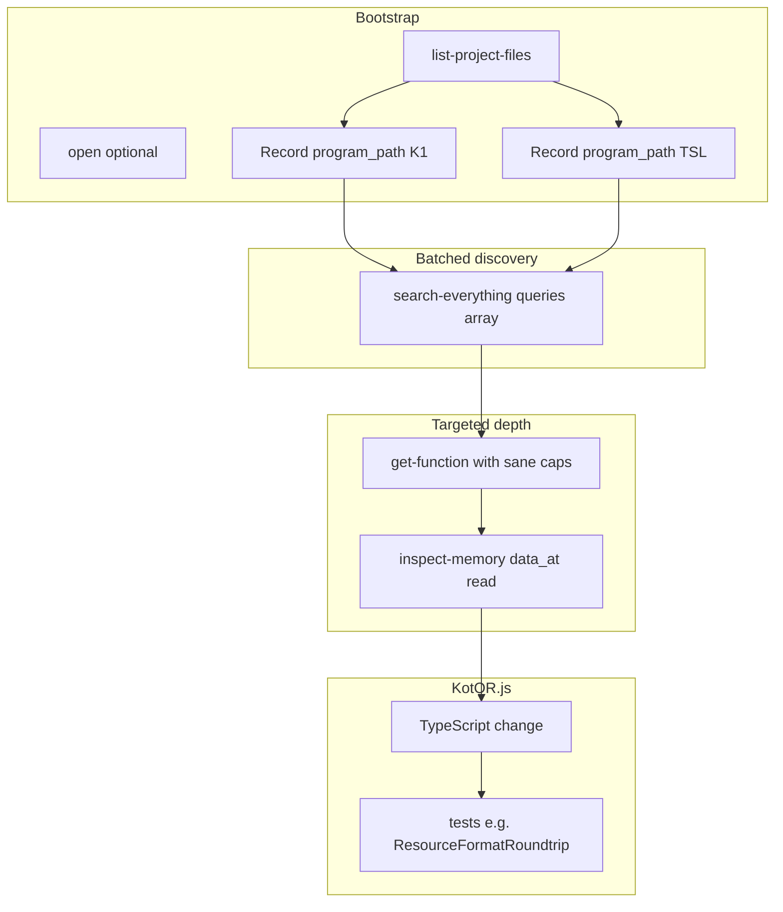

# Authoritative `src/` alignment using agdec-http (K1 + TSL)

## Preconditions and constraints

- **Ghidra ground truth**: agdec-http exposes Ghidra/AgentDecompile operations ([`get-function.json`](C:\Users\boden\.cursor\projects\c-GitHub-KotOR-js\mcps\user-agdec-http\tools\get-function.json), [`search-everything.json`](C:\Users\boden\.cursor\projects\c-GitHub-KotOR-js\mcps\user-agdec-http\tools\search-everything.json), [`inspect-memory.json`](C:\Users\boden\.cursor\projects\c-GitHub-KotOR-js\mcps\user-agdec-http\tools\inspect-memory.json), [`import-binary.json`](C:\Users\boden\.cursor\projects\c-GitHub-KotOR-js\mcps\user-agdec-http\tools\import-binary.json), [`export.json`](C:\Users\boden\.cursor\projects\c-GitHub-KotOR-js\mcps\user-agdec-http\tools\export.json), plus symbol/function management and [`execute-script.json`](C:\Users\boden\.cursor\projects\c-GitHub-KotOR-js\mcps\user-agdec-http\tools\execute-script.json) for custom Ghidra API passes).
- **You chose K1 and TSL**: every discovery pass should run (or be explicitly reconciled) against **two** `program_path` values so divergences become first-class: either `version === K1|K2` branches in TypeScript (already used for [`NWScriptDefK1` / `NWScriptDefK2`](C:\GitHub\KotOR.js\src\nwscript\)) or documented behavioral deltas.
- **Scale**: [`src/`](C:\GitHub\KotOR.js\src) contains **~1200** TypeScript files. “Exhaustive” is achievable as a **repeatable program** (matrix + batched queries + sign-off per subsystem), not as a single PR.
- **Repository policy** ([`.cursorrules`](C:\GitHub\KotOR.js\.cursorrules)): avoid shipping process-heavy “RE methodology” writeups *inside* the tree; in-code rationale should read as **“observed original game behavior”** and behavioral parity. Keep the detailed agdec call logs / screenshots / decompilation excerpts in **PR bodies, private notes, or a non-committed local log** (unless you explicitly opt in to a doc).

## Phase 0: Project bootstrap (must be deterministic)

1. **List programs** via MCP `list-project-files` and record the exact `program_path` strings for the KotOR 1 and TSL main executables in the shared **Odyssey** project (no guessing names).
2. If nothing is open, use MCP `open` to attach the local/shared `.gpr` per tool docs ([`open.json`](C:\Users\boden\.cursor\projects\c-GitHub-KotOR-js\mcps\user-agdec-http\tools\open.json)).
3. (Optional) Pull lightweight inventories via MCP resources (e.g. `agentdecompile://list-functions`, `agentdecompile://structures` per [`Functions.json`](C:\Users\boden\.cursor\projects\c-GitHub-KotOR-js\mcps\user-agdec-http\resources\Functions.json) / [`Structures.json`](C:\Users\boden\.cursor\projects\c-GitHub-KotOR-js\mcps\user-agdec-http\resources\Structures.json)) to anchor naming conventions before searching.

**Output artifact (external to repo)**: a two-row table `{program_path, binary, notes}` used as the first column in the coverage matrix below.

## Phase 1: Build a coverage matrix (src folder → query bank → agdec anchors)

Create a **Subsystem × Evidence × Implementation** table (PR attachment or local file). Rows are grouped like this, ordered by typical binary signal strength:

| Priority | `src` area | Primary `search-everything` term batches | KotOR.js touchpoints |
| --: | -- | -- | -- |
| P0 | `src/resource/` + `src/utility/binary/` | Archive: `BIF` `KEY` `RIM` `ERF` `HAK` `chitin` `SFP` + resource type strings from [`ResourceTypes.ts`](C:\GitHub\KotOR.js\src\resource\ResourceTypes.ts) | Parsers, endianness, edge cases, writer symmetry |
| P0 | `src/odyssey/` + `src/three/odyssey/` + walkmesh | `mdl` `mdx` `wok` `walk` `Dangly` `Saber` + node/controller strings | Controllers, compression paths, walkmesh |
| P1 | `src/nwscript/` | `NCS` `NSS` `action` + known opcode/system routine strings | VM ops, `NWScriptDefK1/K2` parity |
| P1 | `src/video/` (e.g. bink) | `bink` `BIK` `bik` | Demuxer/decoder details |
| P2 | `src/effects/`, `src/managers/`, `src/gui/` | subsystem keywords | Only after anchors exist; higher spec ambiguity |
| P2 | `src/apps/*` (Forge/Launcher) | N/A (mostly reimplementation UI) | Keep mostly out of agdec loop unless behavior bugs trace to engine |

**Rule for “authoritative”**: a row is not “done” until it has **(a)** a ranked hit list from `search-everything`, **(b)** at least one `get-function` deep pass on a leaf parser/handler, and **(c)** a test gap closed or a documented behavioral delta between K1/TSL with code encoding that delta.

## Phase 2: Discovery: `search-everything` first, always batched

Follow the tool’s contract ([`search-everything.json`](C:\Users\boden\.cursor\projects\c-GitHub-KotOR-js\mcps\user-agdec-http\tools\search-everything.json)):

- **Single call, multiple terms**: use `queries: [...]` and avoid spamming the tool.
- **Defaults matter**: do not lower `per_scope_limit` / `max_functions_scan` / `max_instructions_scan` without cause; use explicit `mode: regex` when searching patterns like `\.sav` to avoid the documented false-positive hazard in `auto`.
- **K1+TSL**: run the same batch for both `program_path` values and diff the top function hits; if divergent, split follow-up work into two workstreams.

**Example batch themes** (illustrative; expand as the matrix is filled):
- LTR: `LTR` `nwnltr` `Markov` and character set sizes (ties to [`LTRObject.ts`](C:\GitHub\KotOR.js\src\resource\LTRObject.ts) + [`LTRObject.test.ts`](C:\GitHub\KotOR.js\src\resource\LTRObject.test.ts))
- SSF/TLK/WAV: `SSF ` `TLK ` `WAV` and version tags (ties to `SSFObject` / `TLKObject` / `WAVObject`)
- GFF: `GFF` `GFF ` struct/field reading patterns (ties to [`GFFObject`](C:\GitHub\KotOR.js\src\resource\GFFObject.ts) suite)

**Output**: ranked candidate symbols/functions per subsystem, tagged `{K1-only, TSL-only, both}`.

## Phase 3: Deep passes: `get-function` and memory proofs

For each shortlist, use `get-function` ([`get-function.json`](C:\Users\boden\.cursor\projects\c-GitHub-KotOR-js\mcps\user-agdec-http\tools\get-function.json)) as the all-in-one inspector:

- **Start with conservative graph expansion**: if noise is high, set `caller_depth` / `callee_depth` to `0` and widen later.
- **Cross-check layout claims** with `inspect-memory` modes `data_at` / `read` ([`inspect-memory.json`](C:\Users\boden\.cursor\projects\c-GitHub-KotOR-js\mcps\user-agdec-http\tools\inspect-memory.json)) when validating struct offsets or file-header parsing.
- **Bulk typing** (optional, heavy): `export` to `format: cpp` with controlled flags ([`export.json`](C:\Users\boden\.cursor\projects\c-GitHub-KotOR-js\mcps\user-agdec-http\tools\export.json)) to extract typedefs/structs for comparison — only when pointwise `get_function` is insufficient.

**Output**: a small “evidence pack” per change: {function names/addresses, key control-flow facts, and the exact `src` file+API being corrected}.

## Phase 4: `src` implementation and tests (what “done” means)

- **Code**: align parsers with observed behavior, preserve existing public surfaces unless a breaking change is intended and version-gated.
- **Tests** (mandatory for format work): extend existing suites like [`ResourceFormatRoundtrip.test.ts`](C:\GitHub\KotOR.js\src\resource\ResourceFormatRoundtrip.test.ts) and add **binary-level** fixtures (checked-in minimal bytes you are legally allowed to use) where gaps exist; for proprietary blobs, use **synthetic** minimal buffers that still exercise the branch you fixed.
- **K1 vs TSL**: if behavior differs, encode it explicitly (the repo already has precedent with dual NWScript definition files).

## Phase 5: optional Ghidra maintenance (improves future runs)

- Use `manage-function` to rename/annotate hot functions in Ghidra only if your team uses that shared project long-term; otherwise keep evidence external.
- Use `execute-script` as last resort for cross-cutting queries not exposed by `search-everything`.

## Phased “exhaustive completion” definition

You are “exhaustive” for this repo when the matrix has **all P0–P1 rows** closed with dual-binary notes and the selected P2 rows (if any) are either closed or explicitly deferred with rationale. Anything beyond that is a rolling backlog, not a single deliverable.

## Suggested first implementation slices (after agdec points at a specific bug)

- **Resource formats** under [`src/resource/`](C:\GitHub\KotOR.js\src\resource) + binary helpers in [`src/utility/binary/`](C:\GitHub\KotOR.js\src\utility\binary)
- **Odyssey/rendering** under [`src/odyssey/`](C:\GitHub\KotOR.js\src\odyssey) / [`src/three/odyssey/`](C:\GitHub\KotOR.js\src\three\odyssey)
- **NWScript** under [`src/nwscript/`](C:\GitHub\KotOR.js\src\nwscript)

## Tooling / CI expectations (per [`AGENTS.md`](C:\GitHub\KotOR.js\AGENTS.md))

After non-trivial TS changes: `npm run format:check`, `npm run lint`, `npm test`, and at least `npm run webpack:dev` (or `webpack:prod` if bundling behavior is touched).
