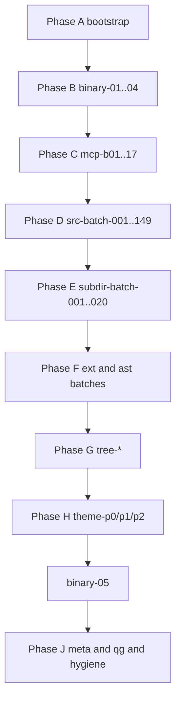

# Agdec `src/` alignment — batched one-response continuation plan

## Relationship to the old plan

This supersedes the intent of [.cursor/plans/agdec_src_alignment_loop_d358aa75.plan.md](.cursor/plans/agdec_src_alignment_loop_d358aa75.plan.md): same **evidence pipeline** (bootstrap → batched `search-everything` → `get-function` / `decompile-function` → `execute-script` as escape hatch → TS + tests → comment hygiene), with **granular todos** so each **continue** maps to **exactly one** todo ID.

## What “30,000+ instructions” means (no 30k YAML rows)

Per [.cursor/k1-iteration-axes.md](.cursor/k1-iteration-axes.md) and [.cursor/k1-binary-exe-coverage-model.md](.cursor/k1-binary-exe-coverage-model.md), the retail program has on the order of **10⁴** decompiled **functions** and a very large **instruction** count. The repo’s **authoritative** way to cover that surface **without** one row per instruction is:

1. **Private** full manifest (or export) + **hash** + **inclusion rules** — **BINARY-01**
2. **Domain partition** — **BINARY-02**
3. **N/A / out-of-scope register** — **BINARY-03**
4. **Map domains** → [.cursor/k1-client-alignment-matrix.md](.cursor/k1-client-alignment-matrix.md) / `src/` areas — **BINARY-04**
5. After `**SRC-####` / MCP work** exists, **cross-check** file ledger ↔ domains — **BINARY-05** (late in this plan)

Individual responses **do not** complete “30k instructions”; they complete **one checklist unit** below (a batch, a BINARY step, one MCP-B theme, etc.).

## Canonical lists (do not skip)

| Axis                     | Count    | File                                                                                                   |
| ------------------------ | -------- | ------------------------------------------------------------------------------------------------------ |
| Per-file TS              | **1490** | [.cursor/k1-iteration-todos-exhaustive.md](.cursor/k1-iteration-todos-exhaustive.md)                   |
| Per-folder TS            | **200**  | [.cursor/k1-iteration-todos-exhaustive-subdirs.md](.cursor/k1-iteration-todos-exhaustive-subdirs.md)   |
| Optional `.scss`/`.html` | **91**   | [.cursor/k1-iteration-todos-optional-assets.md](.cursor/k1-iteration-todos-optional-assets.md)         |
| Repo TS outside `src/`   | **36**   | [.cursor/k1-iteration-todos-repo-ts-outside-src.md](.cursor/k1-iteration-todos-repo-ts-outside-src.md) |

Verify/regen: `npm run k1:exhaustive` / `k1:exhaustive:all`, `[python .cursor/scripts/verify_k1_iteration_exhaustive.py](.cursor/scripts/verify_k1_iteration_exhaustive.py)`.

## Batching rules (one todo = one response)

**Definition of done** for almost every todo (adapt wording per ID):

1. **Discovery:** batched `search-everything` (or `search-symbols`) with **queries** logged (private/PR notes — not tool dumps in `src/` comments).
2. **Deep:** at least one `**get-function**` (or `decompile-function`) on a **hot** symbol **when hits warrant** changes; `**execute-script**` only for bulk enumeration / custom Ghidra API passes ([AGENTS.md](AGENTS.md), MCP schemas).
3. **TS/tests:** implement only what evidence supports; extend Jest where parsers/runtime touched.
4. **Hygiene:** no new disallowed `src/` comment patterns ([.cursorrules](.cursorrules)); sweep touched files.
5. **K1 vs TSL:** `[N/A K1]` with one-line reason in **private** notes when applicable ([.cursor/k1-iteration-todos.md](.cursor/k1-iteration-todos.md)).
6. **Validation:** for edits in the todo, run the smallest **meaningful** subset of `format:check` / `lint` / `npm test -- --runTestsByPath …` / `webpack:dev` per [AGENTS.md](AGENTS.md). Full-repo gates appear where `**qg-***` todos say so.

**Fallback order:** `user-agdec-http` → stdio `user-agdec-mcp` → `uvx` CLI with **env-only** credentials ([k1-binary-exe-coverage-model.md](.cursor/k1-binary-exe-coverage-model.md) §2b).

---

## Phase A — Bootstrap (5 todos)

| ID             | Completes in one response                                                                                                                                                                   |
| -------------- | ------------------------------------------------------------------------------------------------------------------------------------------------------------------------------------------- |
| `bootstrap-01` | Run `python .cursor/scripts/verify_k1_iteration_exhaustive.py` (exit 0). If fail: regen via scripts referenced in [.cursor/k1-iteration-todos.md](.cursor/k1-iteration-todos.md) (META-05). |
| `bootstrap-02` | `list-project-files` / `open`; record **K1** `program_path` in **private** notes/PR table only.                                                                                             |
| `bootstrap-03` | Same for **TSL** when a todo touches `game/tsl/` or dual-title symbols; else note **[skipped]** with reason.                                                                                |
| `bootstrap-04` | Read MCP tool schemas for `search-everything`, `get-function`, `execute-script` (local `mcps/user-agdec-http/tools/*.json`); document **limits** (`limit`, `per_scope_limit`, pagination).  |
| `bootstrap-05` | Confirm CLI fallback **env** names only; no credentials in git; `.env` gitignored.                                                                                                          |

---

## Phase B — Binary inventory early steps (4 todos)

| ID          | Content                                                                                                                  |
| ----------- | ------------------------------------------------------------------------------------------------------------------------ |
| `binary-01` | **BINARY-01:** Private manifest (or export) of `k1_win_gog_swkotor.exe` — count, inclusion rules, hash in private notes. |
| `binary-02` | **BINARY-02:** Domain partition of manifest.                                                                             |
| `binary-03` | **BINARY-03:** N/A / out-of-scope register (versioned, private/team).                                                    |
| `binary-04` | **BINARY-04:** Map domains → alignment matrix rows / `src/` areas (percent triaged or N/A).                              |

---

## Phase C — MCP discovery batches (17 todos)

One todo per row (same strings as [k1-iteration-todos.md](.cursor/k1-iteration-todos.md) MCP-B section):

`mcp-b01` … `mcp-b17` — **MCP-B01** (Containers) through **MCP-B17** (TSL-only symbols / `[N/A K1]` column).

---

## Phase D — Per-file `SRC-####` batches (149 todos)

**Fixed batch size: 10 files per todo.** Formula for batch `k` where `k` ∈ **1..149**:

- **SRC range:** `SRC-{(k-1)*10 + 1}` through `SRC-{min(k*10, 1490)}`
- Example: `src-batch-001` = SRC-0001–SRC-0010; `src-batch-149` = SRC-1481–SRC-1490.

For each `src-batch-kkk`:

1. Open [.cursor/k1-iteration-todos-exhaustive.md](.cursor/k1-iteration-todos-exhaustive.md); locate the range.
2. Run **batched** `search-everything` **queries** themed per top-level folder ([folder→batch table](.cursor/k1-iteration-todos.md) “Default map”).
3. `**get-function**` on shortlisted symbols tied to **behavior claims** in those files.
4. Align TS/tests; mark **[N/A]** in private notes for Forge/Electron/harness-only rows where appropriate.
5. Mini-validation for touched paths.

**Complete list of IDs:** `src-batch-001` … `src-batch-149` (explicit SRC spans above).

---

## Phase E — `SUBDIR-####` batches (20 todos)

**Batch size: 10 directories per todo.** For batch `j` ∈ **1..20**:

- **SUBDIR range:** `SUBDIR-{(j-1)*10 + 1}` … `SUBDIR-{min(j*10, 200)}`

IDs: `subdir-batch-001` … `subdir-batch-020`.

**Closure rule:** For each folder row, confirm every `SRC-####` under that path is closed **or** the whole folder is **[N/A]** with one reason (per [.cursor/k1-iteration-todos-exhaustive-subdirs.md](.cursor/k1-iteration-todos-exhaustive-subdirs.md)).

---

## Phase F — Optional non-`src` TS and UI assets (14 todos)

| Block              | IDs                               | Ranges                                                                                                                                        |
| ------------------ | --------------------------------- | --------------------------------------------------------------------------------------------------------------------------------------------- |
| **EXT** (36 files) | `ext-batch-001` … `ext-batch-004` | 10+10+10+6 files in order from [k1-iteration-todos-repo-ts-outside-src.md](k1-iteration-todos-repo-ts-outside-src.md)                         |
| **AST** (91 files) | `ast-batch-001` … `ast-batch-010` | 9×10 + 1 (10th batch has 1 file) — use file order from [k1-iteration-todos-optional-assets.md](.cursor/k1-iteration-todos-optional-assets.md) |

Default **N/A to retail EXE** for editor-only rows unless a row claims gameplay parity.

---

## Phase G — `SRC-DIR-*` top-level trees (29 todos)

One todo per checkbox in [k1-iteration-todos.md](.cursor/k1-iteration-todos.md) (lines 75–104):

`tree-actions`, `tree-apps`, `tree-assets`, `tree-audio`, `tree-combat`, `tree-controls`, `tree-devtools`, `tree-effects`, `tree-electron`, `tree-engine`, `tree-enums`, `tree-events`, `tree-game`, `tree-gui`, `tree-interface`, `tree-loaders`, `tree-managers`, `tree-module`, `tree-nwscript`, `tree-odyssey`, `tree-resource`, `tree-server`, `tree-shaders`, `tree-talents`, `tree-tests`, `tree-three`, `tree-types`, `tree-utility`, `tree-video`, `tree-worker`.

Each response: confirm all `SRC-####` under that tree (from exhaustive list) are addressed **or** **[N/A]**; log MCP batch theme used.

---

## Phase H — Thematic P0–P2 rollup (3 todos)

The **detailed** P0/P1/P2 checklists in [k1-iteration-todos.md](.cursor/k1-iteration-todos.md) are **themes**, not extra files. Three todos cross-walk every checkbox:

| ID         | Scope                                                                                                                                         |
| ---------- | --------------------------------------------------------------------------------------------------------------------------------------------- |
| `theme-p0` | All **P0-*** rows (Resource, UBN, NWScript, Module, Engine, AXE) — mark **verified** in private notes with links to MCP batches + SRC ranges. |
| `theme-p1` | All **P1-*** rows (combat, events, odyssey, AV, managers, GUI, interface, enums, talents, TST, TSL policy).                                   |
| `theme-p2` | All **P2-*** rows (apps, host, assets, holocron, devtools).                                                                                   |

---

## Phase I — Binary cross-check (1 todo)

| ID          | Content                                                                                                                                  |
| ----------- | ---------------------------------------------------------------------------------------------------------------------------------------- |
| `binary-05` | **BINARY-05:** Cross-check `SRC-####` / MCP-B closure vs domain ledger — no file-only “done” without domain/anchor link (private notes). |

---

## Phase J — META, QG, hygiene (11 todos)

| ID           | Maps to                                                                                                                                                                                                                                             |
| ------------ | --------------------------------------------------------------------------------------------------------------------------------------------------------------------------------------------------------------------------------------------------- |
| `meta-01`    | **META-01** — alignment matrix per-row status/dates                                                                                                                                                                                                 |
| `meta-02`    | **META-02** — binary hash/version in private notes only                                                                                                                                                                                             |
| `meta-03`    | **META-03** — legacy disallowed phrasing on **touched** or sweep scope                                                                                                                                                                              |
| `meta-04`    | **META-04** — closure ledger complete (SRC/SUBDIR/MCP/BINARY links)                                                                                                                                                                                 |
| `meta-05`    | **META-05** — `verify_k1_iteration_exhaustive.py` after any big `src/` moves                                                                                                                                                                        |
| `qg-00`      | **QG-00** — `k1:exhaustive:all` when checklists or `src/**` file set changed                                                                                                                                                                        |
| `qg-01`      | `npm run format:check`                                                                                                                                                                                                                              |
| `qg-02`      | `npm run lint`                                                                                                                                                                                                                                      |
| `qg-03`      | `npm test` (full or policy from AGENTS.md)                                                                                                                                                                                                          |
| `qg-04`      | `npm run webpack:dev`                                                                                                                                                                                                                               |
| `hygiene-01` | Repo-wide or scoped sweep: `ghidra`, `FUN`_, hex-address-in-comments patterns; NWScript bytecode exceptions per [.cursor/plans/agdec_src_alignment_loop_d358aa75.plan.md](.cursor/plans/agdec_src_alignment_loop_d358aa75.plan.md) §Comment hygiene |

---

## Execution order (recommended)

**Parallelism:** You may **interleave** `mcp-b`** with `src-batch-**` **only** if private logs tie queries to file batches; strict linear order above minimizes gaps.

**Continue discipline:** After each user message **continue**, execute **the next single todo ID** in order **unless** you are rewinding for a failed `qg-00`/verification.

---

## Completeness checklist (zero omissions vs repo contracts)

- All **1490** `SRC-####` rows covered by **149** `src-batch-`* todos (formula verified: 149×10 = 1490).
- All **200** `SUBDIR-####` rows covered by **20** `subdir-batch-`* todos.
- **91** AST + **36** EXT covered by **Phase F** batches (or explicitly skipped with reason).
- **29** `SRC-DIR-`* trees covered by **Phase G**.
- **17** MCP-B + **5** BINARY + **3** theme rollups + **11** META/QG/hygiene covered.
- **30k+ binary instructions** addressed only via **BINARY-01..05** + domain/N/A model — **not** duplicated as fake per-instruction todos.

**Grand total todo count:** 5 + 4 + 17 + 149 + 20 + 4 + 10 + 29 + 3 + 1 + 11 = **253** discrete todos.

---

## Artifact to add after approval (execution phase, not now)

When you exit plan mode and want this stored as a project plan file, add e.g. `[.cursor/plans/agdec_src_alignment_batched_253_todos.plan.md](.cursor/plans/agdec_src_alignment_batched_253_todos.plan.md)` with this content **plus** an **appendix** table listing all **149** `src-batch` rows with exact `SRC-####` bounds (mechanically copy-paste from `k1-iteration-todos-exhaustive.md` or generate with a 10-line script). The appendix is **redundant** with the formula but satisfies “meticulous” cross-checking by hand.