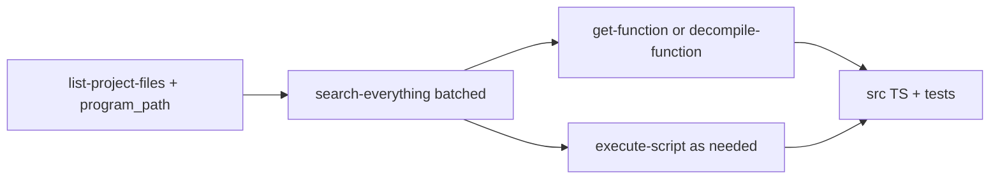

# Agdec-driven `src/` alignment (continuation)

## Scope clarification (important)

- **The 35 tools under** `[mcps/user-agdec-http/tools/](C:\Users\boden\.cursor\projects\c-GitHub-KotOR-js\mcps\user-agdec-http\tools)` **are not each supposed to have a “TypeScript equivalent” in** `src/`. They are **MCP surface area** (search, decompile, export, manage symbols, etc.).
- What you want aligned with TypeScript is **retail executable behavior**, expressed as **symbol-level evidence** for the **subsystems** that the repo maps to `src/` (see `[.cursor/plans/agdec-http_src_alignment_dedff0a8.plan.md](C:\GitHub\KotOR.js\.cursor\plans\agdec-http_src_alignment_dedff0a8.plan.md)`, `[.cursor/k1-binary-exe-coverage-model.md](C:\GitHub\KotOR.js\.cursor\k1-binary-exe-coverage-model.md)`, `[.cursor/k1-iteration-todos.md](C:\GitHub\KotOR.js\.cursor\k1-iteration-todos.md)`).
- “Do not stop until every function is done” is **not literally achievable** as 30k+ one-to-one TS functions; the **authoritative** bar in-repo is: **phased subsystems** + **domain/anchor coverage** + **N/A register** for out-of-scope glue (documented in **private/PR** notes, not in process-heavy `src/` docs), matching the model in §1–3 of the coverage doc.

## Evidence pipeline (matches your “get-function / execute-script” requirement)

1. **Bootstrap**
  - Call `list-project-files` / `open` as needed. Record **exact** `program_path` for **K1 and TSL** when both matter (`[agdec-http` plan](C:\GitHub\KotOR.js.cursor\plans\agdec-http_src_alignment_dedff0a8.plan.md) Phase 0).
2. **Discovery (batched)**
  - Use `search-everything` with `**queries: [...]`** in one call per batch (see `[search-everything.json](C:\Users\boden\.cursor\projects\c-GitHub-KotOR-js\mcps\user-agdec-http\tools\search-everything.json)` schema).  
  - Theme batches using the **top-level `src` → MCP batch** table in `[.cursor/k1-iteration-todos.md](C:\GitHub\KotOR.js\.cursor\k1-iteration-todos.md)` (e.g. `resource/`+`utility/` → B01–B04, `nwscript/` → B05, `module/` → B07, etc.).
3. **Decompilation (primary)**
  - For each **shortlisted binary symbol** tied to a code change, use `**get-function`** first — the tool is explicitly the **all-in-one** inspector that returns **decompiled C** among other data (`[get-function.json](C:\Users\boden\.cursor\projects\c-GitHub-KotOR-js\mcps\user-agdec-http\tools\get-function.json)`).  
  - If you only need the decompile slice, `decompile-function` is a narrower alternative (`[decompile-function.json](C:\Users\boden\.cursor\projects\c-GitHub-KotOR-js\mcps\user-agdec-http\tools\decompile-function.json)`).
4. `**execute-script` (when you said it is mandatory)**
  - Use it for **Python-in-Ghidra** work that `get-function` does not cover: e.g. **enumerating all functions** with a stable key list into `__result__`, or custom API passes (per `[execute-script.json](C:\Users\boden\.cursor\projects\c-GitHub-KotOR-js\mcps\user-agdec-http\tools\execute-script.json)`).  
  - **Do not** treat `execute-script` as the default per-function decompiler; it is the **escape hatch** for bulk or custom analysis — consistent with the tool description and with [AGENTS.md](C:\GitHub\KotOR.js\AGENTS.md) (primary path is the structured tools).
5. **Deep layout proofs**
  - Use `inspect-memory` / `read-bytes` when validating struct offsets or file headers (see plan Phase 3 and `[inspect-memory](C:\Users\boden\.cursor\projects\c-GitHub-KotOR-js\mcps\user-agdec-http\tools)` if present in your tree).
6. **Fallback order** (same as repo policy)
  1. `**user-agdec-http`** (this workspace’s MCP).
  2. **stdio `user-agdec-mcp`** if enabled — read **that** server’s `tools/*.json` (schemas can differ, including `search-everything`).
  3. `**uvx` + `agentdecompile-cli`** — use **only** the **env-var** pattern from `[.cursor/k1-binary-exe-coverage-model.md](C:\GitHub\KotOR.js\.cursor\k1-binary-exe-coverage-model.md)` §2b (host/port/user/password/repository in environment, **never** commit literals). **Do not** paste or store credentials from chat in the repo.

## “Next file(s)” — practical continuation point

Your git status shows heavy churn under `[src/resource/*.ts](C:\GitHub\KotOR.js\src\resource)` and several companion `**REVA_*.md`** files under `src/`. A coherent **next slice** is:

- **P0 resource stack:** align parsers/tests for the modified resource types (BIF/KEY/GFF/ERF/LIP/LTR/SSF/TLK/TPC/TwoDA/etc.) using **batched** `search-everything` on both programs where applicable, then `**get-function`** on the *CExo / file-layer** hot symbols referenced in `[.cursor/k1-iteration-todos.md](C:\GitHub\KotOR.js\.cursor\k1-iteration-todos.md)` (P0 EXE blurb: `CExoResFile`, `CERFFile`, GFF).  
- **In parallel,** finish behavioral notes for the existing **[REVA_*.md](C:\GitHub\KotOR.js\src)** set only where they are still missing mapping — keep language **neutral** (`REVA_DISPLAY_FEEDBACK_TEXT.md` is already a good pattern).

For **exhaustive file coverage**, the canonical queue is the **1490** `SRC-####` rows in `[.cursor/k1-iteration-todos-exhaustive.md](C:\GitHub\KotOR.js\.cursor\k1-iteration-todos-exhaustive.md)` (regenerated by scripts in `.cursor/scripts/` as documented in `k1-iteration-todos.md`).

## TypeScript and tests

- **Implement** only the behaviors **supported by** the decompilation/control-flow you pulled (no drive-by refactors).  
- **Tests:** extend existing format roundtrips / targeted Jest where parsers changed (`[ResourceFormatRoundtrip.test.ts](C:\GitHub\KotOR.js\src\resource\ResourceFormatRoundtrip.test.ts)` and per-file `*.test.ts` next to objects).  
- **Validation bar:** `npm run format:check`, `npm run lint`, `npm test`, and `npm run webpack:dev` per [AGENTS.md](C:\GitHub\KotOR.js\AGENTS.md) for non-trivial code.

## Comment and doc hygiene (your explicit rule)

- **In `src/*.ts` / `src/*.tsx` / co-located `src/**/*.md`:** do **not** add names of analysis environments, **addresses**, or other tooling-specific implementation hints. Phrase as **“observed original game behavior”** (per `[.cursorrules](C:\GitHub\KotOR.js\.cursorrules)`).  
- **Sweep:** run a targeted search (e.g. `ghidra`, `FUN`_, long hex address patterns in **comments** — distinguish legitimate **NCS bytecode / bitmask** math in NWScript from narrative RE dumps). Example of risky noise: **debug `console` / template strings** in `[NWScriptControlNodeToASTConverter.ts](C:\GitHub\KotOR.js\src\nwscript\decompiler\NWScriptControlNodeToASTConverter.ts)` that echo `Address: 0x...` — either remove, gate behind dev-only, or rephrase without presentation as “binary address truth.”

## What “done” means for this continuation

- A **closed evidence loop** for the **chosen subsystem slice** (search → `get-function` on representative symbols → TS + tests) with **K1 vs TSL** called out when behavior diverges.  
- **No** new disallowed commentary in `src/`.  
- **CLI/remote secrets** only via **gitignored env** or private runbooks, matching repo policy — **not** the inline one-liner with live credentials from chat.

