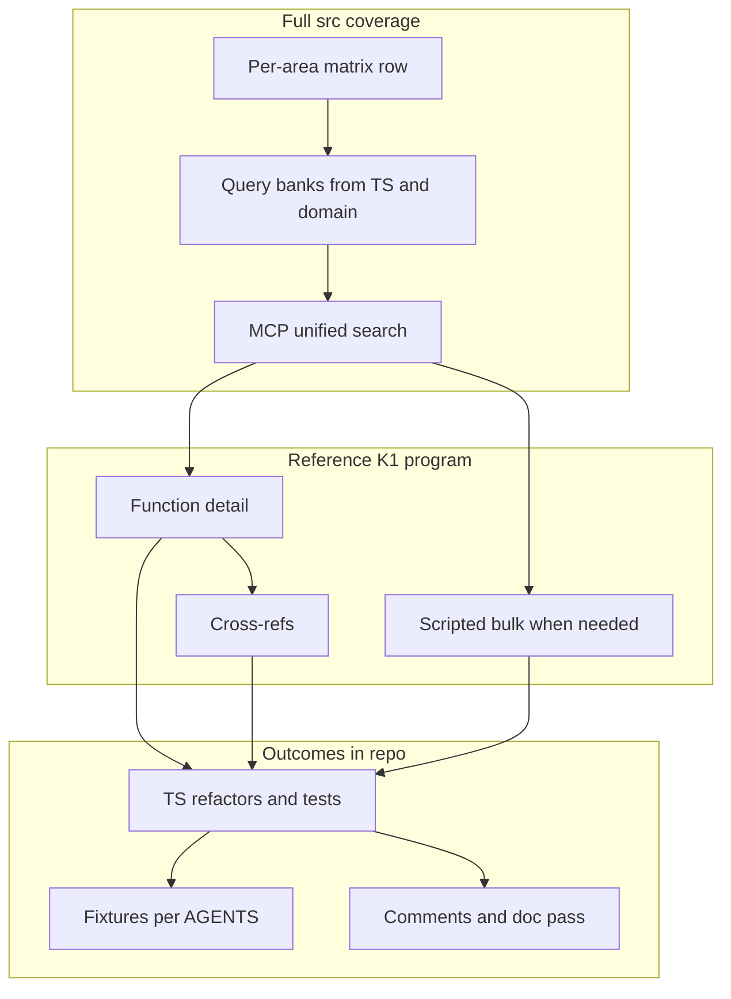

# KotOR 1 (Windows GOG) reference: full-`src/` TypeScript alignment

**Exhaustive execution backlog (v2):** [`.cursor/k1-iteration-todos.md`](../k1-iteration-todos.md) — thematic checkboxes (P0–P1–P2, 17 MCP batches, quality gates, meta). **Index of all axes:** [k1-iteration-axes.md](../k1-iteration-axes.md). **Per-`src` file coverage (one row per `src/**/*.ts` and `src/**/*.tsx`; **1490** last regen, incl. apps, tests, `.d.ts`):** [`.cursor/k1-iteration-todos-exhaustive.md`](../k1-iteration-todos-exhaustive.md) — regen: `python .cursor/scripts/regenerate_exhaustive_src_checklist.py` — verify: `python .cursor/scripts/verify_k1_iteration_exhaustive.py` (preferred) or `python .cursor/scripts/diff_exhaustive_src.py`. **Per-folder coverage (one row per `src/` directory that directly contains ≥1 `.ts`/`.tsx`; **200** last regen):** [`.cursor/k1-iteration-todos-exhaustive-subdirs.md`](../k1-iteration-todos-exhaustive-subdirs.md) — regen: `python .cursor/scripts/regenerate_exhaustive_src_subdirs.py` — verify: `python .cursor/scripts/verify_k1_iteration_exhaustive.py` (same) or `python .cursor/scripts/diff_exhaustive_src_subdirs.py`. **`src/interface/` JSDoc batch:** [`.cursor/scripts/annotate_interface_observed_behavior.py`](../scripts/annotate_interface_observed_behavior.py) (idempotent; use ASCII punctuation in edits to keep UTF-8 clean). **`src/enums/` JSDoc batch:** [`.cursor/scripts/annotate_enums_observed_behavior.py`](../scripts/annotate_enums_observed_behavior.py) (idempotent; folder-based K1 notes + `server/**` **[N/A]**). **Optional** `.scss` / `.html` in `src/`: [`.cursor/k1-iteration-todos-optional-assets.md`](../k1-iteration-todos-optional-assets.md). The YAML `todos` above that are **completed** covered matrix/bootstrap; **pendings** are the current wave. The expanded matrix: [`.cursor/k1-client-alignment-matrix.md`](../k1-client-alignment-matrix.md).

**Enumerated `@src` (mechanical “done for the list”):** `npm run k1:exhaustive:all` must exit **0** — that proves **1490** per-file + **200** per-direct-folder + **91** optional `src` assets + **36** `extensions/` TypeScript rows match the repo. The backlog is then **per-row** MCP validation and TS changes (or an explicit private **[N/A]**) for each `SRC-####` in [k1-iteration-todos-exhaustive.md](../k1-iteration-todos-exhaustive.md), not adding new checklist files until the tree changes. See [k1-iteration-axes.md](../k1-iteration-axes.md).

**Decompiled EXE function inventory (tens of thousands) vs `src/`:**
Agdec HTTP, Agdec MCP, and the CLI can expose on the order of **10⁴+ functions** for `k1_win_gog_swkotor.exe`. That set is **not** the same as 1490 TypeScript files, and **finishing every `SRC-####` does not by itself** prove that every binary function (or in-scope class of them) is mapped, merged as a duplicate, or given an explicit **[N/A]**. A separate **binary-side** track is required: [k1-binary-exe-coverage-model.md](../k1-binary-exe-coverage-model.md) and checkboxes **BINARY-01**–**BINARY-05** in [k1-iteration-todos.md](../k1-iteration-todos.md) (private manifest + domain map + N/A register + cross-checks). Bounded `search-everything` is for discovery, not a full function census.

## Primary goal

- **Modify `src/` TypeScript** (and tests) so control flow, data handling, and edge cases **match what we learn** from the configured **workspace MCP tools** and optional **CLI** (see [`mcps/`](C:/Users/boden/.cursor/projects/c-GitHub-KotOR-js/mcps) — HTTP server folder first, stdio server second, `uvx`/CLI last). The `program_path` in those tools should point at **`/K1/k1_win_gog_swkotor.exe`** in the shared project.
- Favor **observable parity** with the **original shipped Windows GOG K1 client**: parsers, game rules, UI flows that mirror the classic game, and module/engine behavior. When behavior must differ, say so in neutral product terms, not in terms of how the gap was found.

**Investigation mandate:** Map **all** of `src/` to subsystems, in phases, so no area is skipped. P2 (Forge, launcher) gets either implementation tied to the same **observed** rules or a short **N/A** row with a plain reason (e.g. not game runtime).

**Reference binary identity:** In **private** notes, record which file/hash the analysis project used so the team does not mix builds; do **not** put hashes or file paths in `src/`.

**Related work:** A sibling plan in [`.cursor/plans/`](.cursor/plans/) (dual K1+TSL resource matrix) can inform priorities; this plan stays **K1-only** for the reference program above.

---

## In-repo and public phrasing (mandatory, inconspicuous)

Use **only** neutral, user- and maintainer-appropriate language in **committed** `src/` code, tests, and user-facing docs. **Do not** describe process, toolchains, or internal layout.

| Avoid (never in `src/`, commit messages, or user docs) | Prefer |
| -- | -- |
| Named RE personas, `REVA_*` framing, or internal nicknames for sources | *Observed game behavior* (K1, Windows, retail/GOG when it matters) |
| Process: low-level tool names, vendor product names, “MCP,” “static analysis” in end-user text | *Matches the original game client*, *aligns with vanilla K1* |
| Memory addresses, RVAs, offsets “for parity,” mangled C++ in comments (except public API where already established) | Describe **behavior** (what happens) or point to **tests** / in-engine naming already in the public API |
| “Reverse engineering,” “decomp,” or similar | Omit; use *behavior* / *original client* |

**Consequence for this effort**

- New and edited comments should read like: *“Observed game behavior (K1): …”* or *“The original client …”* — not how the detail was learned.
- **Remove or replace** disallowed phrasing in files you touch. Legacy `REVA_*.md` and old inline comments should be **folded** into neutral TS/MD or dropped; **renaming** those markdown files to neutral names is a follow-up once content is clean.
- **Research artifacts** (screenshots, long digests, private logs) stay **out of the tree**; keep the repo policy aligned with [AGENTS.md](AGENTS.md) and the sibling plan’s “no process-heavy writeups in-tree.”
- The **MCP and CLI** names are **operational** for implementers: reference **tool shapes** in [`mcps/.../tools/*.json`](C:/Users/boden/.cursor/projects/c-GitHub-KotOR-js/mcps) without pasting the same terms into `src/`.

**Security:** do not commit credentials, server hosts, or passwords; use local env and rotation.

**Cursor -32601:** if shortcuts call non-existent *tools* for *prompts* use `list-prompts` and the correct prompts API, not `tools/call` (see `mcps/.../prompts/` — internal layout only).

---

## Tooling order (internal)

1. **HTTP** MCP in workspace (tool descriptors: search, get-function, get-references, execute-script, list-project-files, etc.).
2. **Stdio** MCP backup (same tool names, alternate server).
3. **CLI** last (local install / `uvx` + optional local server for batched `tool-seq`), `program_path` as above.

Set the host analysis runtime env the same way you already do for local `uvx` runs (e.g. `GHIDRA_INSTALL_DIR` in shell env — not documented in `src/`).

---

## Full-`src/` coverage

- One **matrix row** per top-level area; **query banks** for MCP search: domain strings, format tokens, and **where useful for search only** the symbol naming your tooling exposes (not copied into public comments).
- **Constants in `src/`:** separate (a) *file format* magics, (b) *test data*, (c) **legacy comment blocks that look like program counters** — (c) should disappear under this policy, not spread.

---

## Phased execution

### Phase 0 — Matrix and manifest

- Enumerate `src/**` by area (P0 resource/engine/script, P1 gameplay UI, P2 tools).
- Inventory `REVA_*.md` and other legacy markers for **cleanup** when those files are edited.

### Phase 1 — Bootstrap

- `list-project-files` → use `program_path` to the K1 Windows reference binary in the project.

### Phase 2 — Discovery

- Batched `search-everything` with appropriate limits per tool default — one batch per theme where possible.

### Phase 3 — Deep pass → **TypeScript**

- `get-function` / `get-references` (and `execute-script` for bulk) to decide **code** changes. Implement and test. Comments = **inconspicuous** policy only.

### Phase 4 — Quality gate

- `npm run format:check`, `npm run lint`, `npm test`, `npm run webpack:dev` (or prod if bundle semantics change).

---

## Subagents (when executing)

- **ce-repo-research-analyst:** full `src/` matrix and keyword lists (internal).
- **ce-best-practices-researcher:** sustainable batching for high-volume tool use (internal).

---

## Definition of done

- [ ] `src/` TypeScript and tests **reflect** learnings; comments use **observed game behavior** / **original client** phrasing, not process or addresses.
- [ ] [`.cursor/k1-iteration-todos.md`](../k1-iteration-todos.md) (or superset) checked through for the areas you own; P2 N/A where appropriate.
- [ ] Matrix coverage complete (see [`.cursor/k1-client-alignment-matrix.md`](../k1-client-alignment-matrix.md)); P2 N/A where appropriate.
- [ ] Reference program identity in **private** log only; no credentials in git.
- [ ] AGENTS.md validation commands pass for changed areas.
