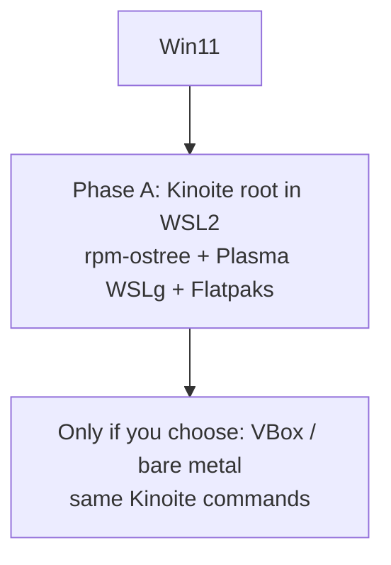

# Fedora **Kinoite in WSL2** — Phase A is **only** this (file name: `silverblue_…` = legacy path; content = **Kinoite** + KDE)

> **Kinoite** = [Fedora’s KDE + atomic/OSTree](https://fedoraproject.org/atomic-desktops/kinoite/) (`rpm-ostree`, rollbacks, Flatpaks, Plasma 6 on real installs). This plan’s **Phase A** means **that stack inside WSL2** first — **not** “close enough” with **classic Fedora (dnf)**.
>
> The filename **`.cursor/plans/silverblue_wsl_workspace_ec9c3c8b.plan.md`** is kept for your **@** references; **Silverblue** is the **GNOME** variant of the same technology — you asked for **Kinoite (KDE)**; the plan is written in those terms.

## Status

- **Materialized** — the sibling workspace **`G:\workspaces\Kinoite`** holds the **executed** tree: `docs/kinoite-wsl2.md`, `WORKSPACE_STATUS.md`, `docs/plan-frontmatter-coverage.md` (all frontmatter `todos` here → files there), and **`imports/*`** (winget + inventory **gitignored** except a committed **`CAPTURE-MANIFEST-*.txt`** per run; full evidence is re-captured with **`scripts/run-full-plan-capture.ps1`**). Set optional **`KINOITE_WORKSPACE_ROOT`** (see **KotOR.js** `AGENTS.md`) so tooling resolves the same path. **Phase B (VirtualBox ISO)** and **Phase C (bare metal)** *install* steps are **on machine**, checklisted in that repo’s `docs/migration-baremetal-checklist.md` / `docs/virtualbox-*.md` + `docs/phases-definition-of-done.md` — not a second copy of “done” inside this plan file.
- This document **replaces** the version that used **“Fedora WSL (classic) as Phase A”**; that is **not** this plan’s Phase A.

---

## Phase A (mandatory, first): **Kinoite in WSL2**

**Goal:** A WSL2 distro that is a **Kinoite / OSTree** system (or a rootfs **exported from the same bits** the atomic desktops ship), so you can run **`rpm-ostree`**, layer packages, use **Plasma** under **WSLg**, and ship **Flatpaks** the same way you will on bare metal.

**This is the default path. Do not substitute** `wsl --install` **official “Fedora for WSL” (classic dnf image)** for Phase A **unless the user explicitly says to abandon Kinoite-in-WSL2** and use a fallback (then see **Optional fallback** below).

### How to get there (concepts — exact commands live in `docs/kinoite-wsl2.md` in execution)

Typical community pattern (to be **validated and pinned to a Fedora release** in TODO `phaseA-kinoite-wsl2-import` + `research-kinoite-rootfs-sources`):

1. **Get a root filesystem** that is **Kinoite/ostree** content (not Server Workstation dnf). Approaches to compare:
   - **OCI** images published by the **Fedora Atomic / ostree** ecosystem (e.g. **quay.io** `fedora-ostree-desktops` org — **verify** current Kinoite tags for your version).
   - **podman** `create` from such an image, **`podman export`** to a **tar** of the container’s rootfs (or an equivalent `skopeo`/`buildah` pipeline that yields a WSL-importable **tar**).
2. On Windows: **`wsl --import <DistroName> <InstallLocation> <rootfs.tar> [--version 2]`** to register the WSL2 instance. Name e.g. **Kinoite-WS2**.
3. **Enable systemd in WSL:** create **`/etc/wsl.conf`** with **`[boot] systemd=true`** and a **`[user]`** default (see `config-wsl.conf.example`).
4. **First boot:** from **inside** the distro, run **`rpm-ostree status`**. A successful Phase A has this **showing a coherent ostree deployment**; if it errors, **capture** output for `docs/kinoite-wsl2.md` and decide (retry / fix) before calling Phase A “done” or before considering fallback.
5. **GUI / Plasma:** with **WSLg**, start **KDE/Plasma** the way the imported tree allows (e.g. **`plasmashell`**, **Wayland** via WSLg, or **session** workarounds — no **SDDM** in WSL is normal; document what worked).
6. **Ongoing work:** `rpm-ostree install …`, `rpm-ostree upgrade`, `rpm-ostree rollback`, user **`~/.var`** for **Flatpaks** — same **mental model** as a laptop Kinoite install.

**Assistant behavior:** For “set up the lab” tasks, **prioritize** **import/verify Kinoite in WSL2**. **Do not** reframe Phase A as **“install Fedora WSL from the Store and call it a day.”** That is **out of plan** for Phase A unless the **user** explicitly approves a **documented** fallback (see **Optional fallback**).

---

## Caveats (why Phase A is fiddly — **not** an excuse to skip Kinoite)

OSTree is built around **real boot** / **initrd** / **kernel** cmdline; WSL2’s init is not a PC BIOS. In practice:

- **`rpm-ostree` rebase / some upgrades** can be **fragile** or need **workarounds**; **document** all failures in **`docs/kinoite-wsl2.md`**.
- A **full** “login manager + full session” like on **bare metal** may be **incomplete**; you still aim for **Kinoite bits + Plasma** usable, not “classic Fedora dnf as Phase A.”

**Mitigations, hard limits, and when to move to a VM** (OSTree `ostree-prepare-root` / BLS, `/run/ostree-booted` + `ostree-finalize-staged`, WSL2 kernel) — repository doc **`docs/kinoite-wsl2.md`**.

**These are risks to *manage* in Phase A, not a switch to a different OS as Phase A.**

---

## Optional fallback (only with explicit user approval — **not** Phase A)

- **“Classic” Fedora in WSL** (Microsoft Store / `wsl --install` **FedoraLinux-…** with **dnf**): use **only** if the user **explicitly** agrees that Phase A (Kinoite/OSTree in WSL) is **blocked** or they want a **side** dnf environment for a specific tool — **and** it must be **labeled** as **not** a substitute for the Kinoite/OSTree workflow, **or**
- **VirtualBox + Kinoite ISO** (or **KVM** on another host): for **true** 1:1 with **bare metal** when you need **no compromises**; see **Phase B/C** in this file.

**Nothing here replaces Phase A** unless the user **says** it does.

---

## Phase B / C: VirtualBox + Kinoite (or bare metal) — not before Phase A direction is resolved

If **Kinoite-in-WSL2** cannot meet your needs **after a serious try**, or you want a **second** line of testing, use a **type-2** (or other) **VM** with the **Kinoite ISO** from:  
[https://fedoraproject.org/atomic-desktops/kinoite/download/](https://fedoraproject.org/atomic-desktops/kinoite/download/)

### VirtualBox (summary — full table remains valid)

- **6–8 GB RAM**, **60+ GB** disk, **EFI on**, **3D + guest additions** after `rpm-ostree install` for RPM Fusion and **VirtualBox Guest Additions** (see [fedora-ostree package names](https://docs.fedoraproject.org/) for the release).
- **Snapshot** before risky `rpm-ostree` / Plasma experiments; **rollback** with **`rpm-ostree rollback`** inside the guest.
- This is **not** “do VirtualBox first”; it is **after** you have a policy on **Phase A** (user says move on, or you run in **parallel** by **choice**).

**Post-install in the VM (example only — not WSL2):**

```bash
sudo rpm-ostree upgrade
sudo systemctl reboot
# RPM Fusion — adjust $(rpm -E %fedora)
sudo rpm-ostree install \
  "https://mirrors.rpmfusion.org/free/fedora/rpmfusion-free-release-$(rpm -E %fedora).noarch.rpm" \
  "https://mirrors.rpmfusion.org/nonfree/fedora/rpmfusion-nonfree-release-$(rpm -E %fedora).noarch.rpm"
sudo systemctl reboot
```

---

## Kinoite vs Silverblue (reference)

|       | **DE**   | **This plan** |
|-------|----------|---------------|
| **Kinoite** | **KDE Plasma 6** | **Target (Phase A: Kinoite userland in WSL2; later: same on VM/bare metal)**. |
| **Silverblue** | **GNOME**        | Same **rpm-ostree** idea; not the chosen DE for this plan. |

---

## Windows C: software inventory (this host, 2026-04-25) + Kinoite alternatives

**If you’re about to ask again:** this heading already covers the **same** request—**installed software** and **Start Menu + Desktop** shortcuts (not a literal file-by-file crawl of all of `C:\`), **Fedora Kinoite** alternatives with **honest** “almost identical” / **gap** notes, **web** links, and the named apps **ShareX, Steam, Discord, Cloudflare WARP** in **`#### Named apps`**. After **big** install/uninstall batches, re-survey the host with **`G:\workspaces\Kinoite\scripts\run-full-plan-capture.ps1`**, then point **`#### Machine-verified snapshot`** and **`WORKSPACE_STATUS.md`** at the new **`imports/CAPTURE-MANIFEST-<stamp>.txt`** in that repo (replaces ad-hoc `winget list` + shortcuts for committed evidence).

> **Nav / scope:** This section is the **only** in-repo, **source-backed** map from **this PC’s** installs (below) to **Fedora Kinoite**-style tooling. **Names you keep asking for:** **ShareX, Steam, Discord, Cloudflare WARP** → see **`#### Named apps (quick ref …)`** and **`#### External references (web)`**, then the **full table** (VPNs, DCC, dev, games, *arr*, etc.). Re-survey with **`run-full-plan-capture.ps1`**, or individually `winget list` / `winget export` / [`../scripts/list-windows-shortcuts.ps1`](../scripts/list-windows-shortcuts.ps1), after **bulk** install/uninstall; **authoritative** timestamped output is under **`G:\workspaces\Kinoite\imports/`** (not only this plan file).

#### Machine-verified snapshot (this session, 2026-04-25)

| Source | What was run | Result (this host) | Where the raw output lives |
|--------|---------------|---------------------|----------------------------|
| **Winget** | `winget list --accept-source-agreements` | **310** lines (table + header; plan “Windows C”) | **`G:\workspaces\Kinoite\imports\winget-list-20260425T173027.txt`** (or latest `winget-list-*.txt` from **`run-full-plan-capture.ps1`**) + index **`imports\CAPTURE-MANIFEST-20260425T173027.txt`** |
| **Shortcuts** | [`../scripts/list-windows-shortcuts.ps1`](../scripts/list-windows-shortcuts.ps1) (also invoked by **`run-full-plan-capture.ps1`**) | **17,908** lines (section headers + one path per line) | **`G:\workspaces\Kinoite\imports\start-menu-shortcuts-20260425T173027.txt`** — large files **gitignored**; manifest and **`WORKSPACE_STATUS.md`** name the current stamp |

**ARP hygiene:** the **full** `winget` table includes **at least one** bogus / joke **ARP (x86)** “product” line—**remove it in Windows** (Settings → Installed apps, or a reputable uninstaller). **Do not** copy its **display name** into git, issues, or this plan.

**Not done (and not practical):** a **recursive listing of every file** on `C:\`. The approach remains **winget + ARP** (what Windows considers installed), **Program Files** spot-check, **Start Menu + Desktop** shortcuts, plus optional `winget export` for JSON.

**Collection method:** `winget list` (all sources), CIM in **`run-windows-inventory.ps1`** (under **`G:\workspaces\Kinoite\scripts\`**), and top-level **`C:\Program Files`** spot-checks in the plan text. **One-shot re-survey of the full tree:** `G:\workspaces\Kinoite\scripts\run-full-plan-capture.ps1` — writes `imports\start-menu-shortcuts-<stamp>.txt`, `winget-list-*.txt`, and a committed **`CAPTURE-MANIFEST-<stamp>.txt`**; bulk `imports\*.txt` is otherwise **gitignored** in that repo. Standalone `list-windows-shortcuts.ps1` can still target **`%TEMP%`**. Current evidence: **~17,908** `.lnk`/`.url` lines in the 2026-04-25 capture—many are **Windows/Store** noise; the **value** is surfacing **third-party** and **game launcher** entries.

**Shortcut *evidence* (non-exhaustive):** **All Users** Start Menu includes **Cloudflare WARP**, **ShareX** (folder, uninstaller), **Steam** (main **.lnk** + help **.url**), full **K-Lite** (MPC, LAV, **madVR**, GraphStudioNext, …), **PotPlayer**, **Plex Media Server**, **Razer** Axon/Cortex, **mitmproxy** (mitmweb/mitmdump), **SoundSwitch**, **Cheat Engine** (many build variants), **3ds Max 2026** / **Maya 2027** / **Autodesk** Access&Flow, **CPUID** CPU-Z/HWMonitor, **AllDup** / **Duplicate Cleaner Free**, **EA** app, **FileZilla**, **Free Pascal** docs, **Git** (Bash/CMD/GUI), **GnuWin32 CoreUtils**, **CMake** (GUI+docs+uninstall), **Jellyfin**/servers per **winget** (icon may be under **Jellyfin** folder if present), **Razer/AMD** tools; **per-user** Start Menu: **Discord**, **RuneLite**, **f.lux**, **LocalSend**, **Spotify**; **ShareX in Startup** (auto-start on login); per-user **Steam\*.url** (Borderlands, Dragon Ball, Killing Floor, KOTOR, Marvel Rivals, …); **VS Code** and **Windsurf**; **Desktops** (Public + user + OneDrive) copy **HTTP Toolkit, SoundSwitch, VSC, Windsurf**. **Remote Desktop** (**mstsc** shortcut under Accessories) — map to **KRDC**/Remmina on Kinoite (RDP/FreeRDP; **SPICE** differs).

**Note:** A literal **walk of every file on `C:\`** is **not** listed here; use **Everything**/WinSearch or `winget export` for **drives** outside `Program Files`. ARP+winget+**Start Menu** cover **nearly all** *installed* apps; **portable** exes in random folders are **out of scope** unless you add a scan. **Unusual ARP** entries (PUP/joke) — **audit in Windows**; do **not** commit strings into git.

**`C:\Program Files` (sample):** includes **7-Zip, Allegorithmic, AMD, AnythingLLM, Application Verifier, Autodesk** (3ds/Maya/Flow/Retopo/USD/Substance/Bifrost/MtoA/…), **Blender Foundation, Bluesky FRC, Cheat Engine, Cloudflare, CMake, cursor, Docker, dotNet/EA/Epic, FileZilla, Git, Godot, Go, HxD, i2p, Intel, Jellyfin, LGS, LM Studio, Logitech, Malwarebytes, mitmproxy, Mozilla, nodejs, Notepad++, OpenVPN, Opera GX, obs-studio, Podman Desktop, PowerShell, PIA, Process Lasso, Python, qBittorrent, RustDesk, ShareX, SoundSwitch, Steam, Tailscale, TeamViewer, VapourSynth, Voicemod, WinDirStat, WSL, XPipe**, and others (matches winget list).

**Winget-visible products (condensed, deduped):** **7-Zip, ShareX, AMD, Bluesky FRC, CPU-Z, HWMonitor, Cheat Engine, GIMP, Git, LSE, HxD, LatencyMon, LockHunter, LGS, Firefox, Notepad++, PotPlayer, Razer, RustDesk, SoundSwitch, Steam** (+ many **Steam** game rows), **TeamViewer, VapourSynth+PFM, WinMerge, Podman Desktop+CLI, LM Studio, AnythingLLM, mitmproxy,** full **Autodesk** stack, **Eclipse Temurin** 17/21/25, **PIA, Malwarebytes, Node, OpenVPN,** iCloud **Outlook** plugin, **WARP, WinDirStat, Autodesk** Access, **Go, Tailscale, Epic+EOS, DefenderUI, Cursor, Windsurf, Pandoc, CMake,** Arnold/USD/Substance/Bifrost, **Voicemod,** AllDup, Duplicate cleaner, GnuWin32, EventGhost, **Chrome**, gcloud, **Jellyfin, K-Lite, Jagex,** Copilot, **Edge, FileZilla, f.lux, Kotor Tool, OBS, Opera GX,** qBittorrent, **Plex,** EA/Dragon Age/Mass Effect **GOG+Origin**, **OpenOffice,** RuneLite, **Stremio, Prowlarr,** Claude, **Discord, Docker, Bun,** GitHub Desktop, **Godot, MiKTeX, LilyPond,** OneDrive, **Rust**up, Replit, **Spotify,** SW:TOR, SuperF4, LocalSend, **HTTP** Toolkit, yq, **Kaitai**, **Amazon** Games, **Code/Teams/iCloud/Terminal/WSL**, AMD/Intel/Realtek **store** apps, **+ .NET/VC++** runtimes (see raw export).

### Fedora Kinoite mapping (aim: *near-identical*; *hard gap* = **Keep Windows / VM**)

| Windows (this machine) | Kinoite-first approach | Parity / gap |
|--------------------------|-------------------------|-------------|
| **ShareX** | **Flameshot** (Flatpak), **Spectacle** (KDE), **Kooha**+**FFmpeg** for short clips, **Obs** for long capture | **No 1:1** for **macro workflows, OCR, and mass download rules**; rebuild **2–3** hotkeys. |
| **Steam** + library | `com.valvesoftware.Steam`; **Proton**; **Bottles**; **Lutris** for scripts | **Gameplay** often **identical**; **anti-cheat** may **forbid** Linux. |
| **Epic/EA/GOG/Amazon** | **Heroic** (`com.heroicgameslauncher.hgl`); **Lutris**; **Bottles**; native GOG *sometimes* | **~**; login/update UX **differs**. |
| **Discord** | `com.discordapp.Discord` or **Vesktop** (Wayland) | **~**; screen-share quality & Rich Presence may differ. |
| **Cloudflare WARP** | [Official repo](https://pkg.cloudflareclient.com/) `cloudflare-warp` + **`warp-cli`**; see [WARP Linux docs](https://developers.cloudflare.com/warp-client/get-started/linux/) | **~**; prefer **one** of WARP/PIA/Tail when debugging **MTU**. |
| **Tailscale** | `tailscale` (rpm or static); **KDE** tray | **High** parity mesh VPN. |
| **PIA, OpenVPN** | **PIA** Linux app or **WireGuard**; **NetworkManager**+OpenVPN/WireGuard profiles | **High** for same credentials. |
| **GIMP 3, Blender, OBS** | Flathub: `org.gimp.GIMP`, `org.blender.Blender`, `com.obsproject.Studio` | **High**. |
| **3ds Max 2026** + **Max** plugins | *No native Linux* | **No parity** on Kinoite; **VM/Win** or retarget **Blender**. |
| **Maya 2027** + MtoA / USD / Bifrost / Substance | **Autodesk Maya for Linux** (see current matrix) + same plug-ins if licensed for Linux | **Close** to identical **vs 3ds**; test **licensing** and **GPU** (NVIDIA) per release notes. |
| **Cursor / VS Code / Windsurf** | **Cursor** AppImage / official Linux; `com.visualstudio.code` or VSCodium | **~**; **Copilot/AI** tied to **vendor** accounts. |
| **7-Zip, WinMerge, HxD, Notepad++** | p7zip/Ark; KDiff3/Meld; Okteta/Bless; **Kate**/**KWrite** | **~**; N++ plug-ins not 1:1. |
| **WinDirStat, PotPlayer, K-Lite** | `org.kde.filelight` / Baobab; **MPV+Celluloid** / **VLC**; **FFmpeg** + GStreamer-**ugly** (rpmfusion) | **Codec** “pack” = **replaced** by **FFmpeg** stack, not a single K-Lite clone. |
| **Jellyfin, Plex, \*arr, Prowlarr** | **Podman** (quadlets) or `org.jellyfin.JellyfinServer`; *arr* upstream Linux images | **Same** apps, **container**-native on Linux. |
| **qBittorrent, FileZilla** | Flathub: **qBittorrent**, **FileZilla** | **High**. |
| **mitmproxy, HTTP Toolkit, gcloud, Pandoc, CMake, gh** | **toolbox** / **host**; **Caido**/**ZAP** as **HTTP** debug alt | **~** for GUI proxy UX. |
| **Docker + Podman Desktop** | **Podman**+**Podman Desktop** (native Fedora); `podman machine` for Mac-like flow | **~**; prefer **rootless** Podman. |
| **Node, Go, Python, .NET, Rust, JDK×N** | **Per-project toolbox**; **mise**/**asdf** in $HOME; **minimize** `rpm-ostree` layer sprawl | **Build** **parity**; **WPF/Win** **.NET** **=** **no**. |
| **Razer, Logitech, Voicemod** | **openrazer**+**Polychromatic**; **Piper**+**Solaar**; **PipeWire**+**Carla**/**EasyEffects** | **RGB** and **pro-audio** **mics**: **~**; **not** the same app. |
| **SoundSwitch, f.lux, SuperF4, Process Lasso** | **Plasma** per-app audio + default device; **Night Color**; `xkill` or **KWin** “kill” shortcut; `chrt`/`ionice`—**no** Windows-style “**gaming mode** / parking” | **Lasso** has **no** Linux clone for same claims. |
| **Cheat Engine** | **GameConqueror** / **scanmem** | **~**; not universal. |
| **TeamViewer, RustDesk** (both) | `com.rustdesk.Rustdesk`; **teamviewer** rpm (vendor TOS) | **Pick** **one** primary; self-host **RustDesk**. |
| **mstsc** (Remote Desktop Connection) | **KRDC** (KDE) / **Remmina** (Flatpak `org.remmina.Remmina`); `xfreerdp` | RDP/FreeRDP **~** Windows client; **credSSP**/NLA quirks differ. |
| **LocalSend** (LAN share) | **LocalSend** Flatpak `org.localsend.localsend_app` (same app on Linux) | **High** parity. |
| **EventGhost** (automation) | **Plasma** shortcuts+**khotkeys**; **systemd** **user** units; **keyd**; **~** to macro apps | **No** visual flow like EG; use **Plasma** **custom shortcuts**. |
| **SSHFS-Win, WinFsp** | **sshfs**+FUSE on host or **box**; **Dolphin** sftp: / **Gvfs** | **FUSE**-native on Linux. |
| **i2p (router)** | `i2p` / **i2pd** in **box** (same network); **I2P** .deb-style **=** N/A 1:1 to Windows bundle | **~** |
| **XPipe** (SSH) | [XPipe](https://github.com/xpipe-io) ships Linux; **Dolphin** `sftp:`+**Mosh**+**KDE** **Konsole** | **~** tool UX. |
| **VapourSynth+AviSynth+K-Lite** pipeline | **Vap** in **FFmpeg** chain in **box**; **Aegisub** etc. per need | **Heavy**; no **single** Windows “codec pack” **UX**. |
| **Malwarebytes, DefenderUI** | **ClamAV**; **firewalld**; read-only root—**EDR** ≠ **1:1** | **No** same **AV**; consider **browsers** hardening. |
| **Jagex / RuneLite, SW:TOR, game GOG/Steam list** | **Lutris**/Proton; **Java** for **RuneLite**; **WINE**-rating per title | **ProtonDB**; **EAC** **fail** → **keep** **Win**. |
| **iCloud, iTunes, iCloud Outlook, Microsoft Teams** | Mostly **web** + **KDE** **Online Accounts**; **Akonadi** + **IMAP/CalDAV**; **Teams** PWA/Flatpak; **iTunes**-like management **=** no Apple parity | **O365/Teams** often **browser-first**; **iCloud** desktop = **N/A** same UX. |
| **Bun, yq, Kaitai, Prowlarr** (with \*arr stack) | `bun` in **box**; **Prowlarr** / **Jellyfin** in **Podman** (same *arr* images) | **CLI/servers** = **high**; **Kaitai** = same tool. |
| **LM Studio, AnythingLLM, Replit,** Copilot, Claude | **Ollama**+**KDE** front-ends, **AnythingLLM** in **Podman**, vendor **web**/Linux .AppImage; **KDE**+**Continue** in VS | **~**; GPU **pass-through** and **HIP/CUDA** differ. |
| **Kotor Tool** (legacy) | **Wine/VM** for legacy; **KotOR.js** **repo** = cross-platform | **Kinoite** dev: align with this repo, not 1990s .exe **only** |
| **Bluesky** FRC | BFI/injection is **Win driver**-specific; on Linux use **MangoHud**, **MESA** **vsync**, or **KWin**/compositor | **N/A** same driver FRC. |
| **Jellyfin, Plex, Stremio (clients+servers)** | `org.jellyfin.JellyfinServer` and/or **Podman**; **Plex** Flatpak; **Stremio** `com.stremio.Stremio` | **Same** upstream apps on Linux. |
| **Copilot, Codex, Claude** (desktop) | **Web**; official **Linux** / **AppImage** where **Anysphere/Anthropic/OpenAI** ship; add **VS Code+Continue** + **KDE** **plugins** in editors | **~**; no single “Copilot desktop” on Linux. |
| **Chrome, Edge, Firefox, Opera GX** | `com.google.Chrome`, `org.mozilla.firefox`, `com.vivaldi.Vivaldi` / **Firedragon**; **Chromium** | **Edge** account sync and **iCloud**-only extensions **=** N/A. |
| **AMD** Link, **Radeon** DVR, **DTS** headphone | **MangoHud**, **GOverlay**, **Plasma** **Wayland**+**Mesa**; **OBS**+**VAAPI**; **DTS** **Spatial** = **N/A**—use **EasyEffects** / **HRTF** plugins |  |
| **KDE** (Kinoite default) | **Dolphin, Spectacle, Ark, Filelight** = daily **files, archives, treemap, screenshots** | Replaces a **slice** of **Explorer+ShareX+7-Zip+WinDirStat**; not **1:1** to **all** **Windows** shell add-ons. |
| **OpenOffice 4.x** | **LibreOffice** `org.libreoffice.LibreOffice` (Flathub) or rpm | **~**; best **ODF/Office** compatibility on Linux. |
| **NSIS** (Nullsoft) / **WiX** / **GitHub Desktop** “deployment” | **NSIS** (`makensis`) / **WiX** / same **Git** flows in **toolbox**; official Linux builds or **Mono**-based | **Build** **parity** for installers; not the **Windows** GUI. |
| **Jade Empire (GOG)** (ARP) | **Heroic** + **Lutris**; Proton as needed | Same idea as other **GOG**—**~** to Windows install. |
| **AviSynth+** (with **VapourSynth**) | **VapourSynth**+**FFmpeg** in **box**; **Aegisub** as needed; AviSynth-on-Linux is niche—prefer **Vap**-native filter chains | **No** single **K-Lite**-style one-click. |
| **Prowlarr** (Store/MSIX sideload on this host) | **Linux** **Docker**/Podman image = upstream **Prowlarr**; same **API** as Windows | **High** for the **server**; **tray** differs. |
| **Windows SDK** + **VS Build Tools 2022** + **.NET SDKs** | **`toolbox`**/CI container with `dnf install` **dotnet**/**gcc**; **Kinoite** host: **avoid** piling `rpm-ostree` **unless** you truly need a **system** tool | **Parity** via **containers**; not bit-identical to **MSVC**. |
| **Ephemeral Gate** (ARP x86) | **Unverified** title in inventory—treat as **“confirm legitimacy / remove if PUP”** | **N/A** until product is **identified**. |
| **Clipchamp, Phone Link, Edge Game Assist** (MSIX) | **KDE** **Kdenlive**/**OBS**; **KDE Connect**; **Chromium**/**Firefox** | **~**; **no** 1:1 to **Microsoft**-only apps. |
| **PhysX** legacy (NVIDIA) | Linux games use **native** physics or **Proton** bundled deps | **N/A** as a **separate** Windows-only redist. |

*Expand this table in **`docs/app-mapping.md`** (TSV) at workspace creation; re-run `winget export` to replace **condensed** rows.*

#### External references (web) — Kinoite-first parity

- **Cloudflare WARP (Linux):** [Get started (Linux)](https://developers.cloudflare.com/warp-client/get-started/linux/), [client packages / repo](https://pkg.cloudflareclient.com/) — on **atomic** hosts: add repo, then `rpm-ostree install cloudflare-warp` (reboot), then **`warp-svc`**: `systemctl enable --now warp-svc` and `warp-cli register` / `warp-cli connect`.  
- **Steam (Flatpak):** [com.valvesoftware.Steam on Flathub](https://flathub.org/apps/com.valvesoftware.Steam) — add **[Proton-GE Flatpak add-on](https://github.com/flathub/com.valvesoftware.Steam.CompatibilityTool.Proton-GE)** for titles that need **GloriousEggroll** builds.  
- **Discord / Vencord+Wayland:** [Vesktop on Flathub](https://flathub.org/apps/dev.vencord.Vesktop) (includes **Venmic** for **screenshare**-adjacent behavior); [Flatpak notes (upstream)](https://vesktop.dev/wiki/linux/flatpak/) — for **raw** official client use `com.discordapp.Discord` on Flathub.  
- **Screenshots (ShareX-style):** [Flameshot](https://flathub.org/apps/org.flameshot.Flameshot), **KDE Spectacle** (default on Kinoite), [Ksnip](https://flathub.org/apps/org.ksnip.ksnip) for more annotation modes.

#### Named apps (quick ref — *same* section as the table, faster to scan)

| You asked | On Fedora Kinoite (first try) | “Almost identical”? |
|------------|-------------------------------|------------------------|
| **ShareX** | **Flameshot** `org.flameshot.Flameshot` + **Spectacle** (KDE) + **OBS** + **`org.ksnip.ksnip`** for heavier annotation; optional **Kooha** (short clip) + `ffmpeg` | **No** 1:1: no single Linux app matches **OCR + uploader recipes + custom workflows**; rebuild in **3–4** **Plasma** shortcuts. |
| **Steam** | **`com.valvesoftware.Steam`**; **Proton**; add **Proton-GE** Flatpak compatibility tool; **Bottles** (Win oddities); **Lutris** for scripts | **Gameplay** often **same**; **EAC/Kernel anti-cheat** and some **launchers** → **no** on Linux. |
| **Discord** | **`com.discordapp.Discord`**; **`dev.vencord.Vesktop`** (Venmic, [Flatpak](https://flathub.org/apps/dev.vencord.Vesktop)) if **XWayland/Wayland** or mod stack matters | **~**; **Rich Presence** in Flatpaks is **limited**; **Go Live** **test** your GPU (NV/AMD/VAAPI). |
| **Cloudflare WARP** | Official [repo](https://pkg.cloudflareclient.com/) + [docs](https://developers.cloudflare.com/warp-client/get-started/linux/): `rpm-ostree install cloudflare-warp` → **reboot**; `systemctl enable --now warp-svc`; `warp-cli …` | **Policy**-wise **~**; **tray** ≠ Windows; on **Kinoite** use **one** primary tunnel + **split** routes when also using **PIA**/**Tailscale**/**OpenVPN** (all present on this PC in **winget**). |
| **+ also on this PC (same idea)** | **Epic/EA/GOG/Amazon** → **Heroic**; **PIA+OpenVPN+Tailscale** → NetworkManager+vendor; **OBS/GIMP/Blender** → same Flathub lines as main table | See main table: **3ds Max**, one-shot **K-Lite**, **iCloud/Teams**, **Voicemod/Razer** drivers, etc. |

**Rules for *almost* identical behavior on atomic KDE**

- **Flathub** default for GUI; **toolbx** for **dnf** dev cacophony; **`rpm-ostree install` only** for what **Flatpak cannot** (e.g. **Razer** kernel, **WARP** repo, **Mesa** **VA**-API **edge** in rare cases).  
- **VPN/overlay** stack: **WARP+Tailscale+PIA+OpenVPN** in parallel on Windows is a **troubleshooting** **risk**—on Linux, **one primary tunnel** + **split routes**; document in **`docs/kinoite-wsl2.md`**.  
- **3ds Max, most anti-cheats, Voicemod-grade DSP, and ShareX-grade automation** → **not** Kinoite parity; **list** in **`docs/keep-windows.md`** (create on execution) or **VBox** for **3ds** only.  
- **KDE Plasma** (Kinoite) replaces most **f.lux, Sound, Night**-related Windows utils **natively** on Wayland.

---

## Workspace path

- **Primary:** `G:\workspaces\Kinoite`  
- **Fallback:** `C:\Users\<you>\workspaces\Kinoite`  
- **Env:** `KINOITE_WORKSPACE_ROOT`  
- **`docs/kinoite-wsl2.md`** = **authoritative** Phase A procedure (supersedes any older “WSL2 = Fedora dnf” wording).

```text
Kinoite/
  README.md
  .gitignore
  docs/
    kinoite-wsl2.md                    # Phase A: import, rpm-ostree, Plasma, caveats
    kinoite-vs-atomic-desktops.md
    strategy-phaseA-kinoite-wsl2.md    # optional, or merge into README
    app-mapping.md                     # TSV from plan table + `winget export` (on execution)
    keep-windows.md                    # workloads with no Kinoite parity (3ds Max, some anti-cheats, etc.)
    virtualbox-kinoite-fallback.md
    (… other topic docs from prior plans …)
  config/
  scripts/
  imports/
```

---

## Mermaid: Phase A = Kinoite WSL2



---

## Risks

- **Kinoite-in-WSL2** may need **iterative** fixes; **the plan still treats it as Phase A.**
- **Max layers** and **rebase** behavior may differ from bare metal; **re-read** Fedora **atomic** docs at cutover.
- **VirtualBox** is a **separate** environment, not a replacement for **stating** Phase A unless you **decide** to deprioritize WSL2 Kinoite.

## Event / reliability (optional)

Optional **PowerShell** exports to **`imports/`** — see TODOs.

---

*Version: 2026-04-25 (revised: **Machine-verified snapshot** rows + `run-full-plan-capture` — **winget list 310** lines, **Start Menu export 17,908** lines, **CAPTURE-MANIFEST-20260425T173027** in `G:\workspaces\Kinoite\imports\`). **Phase A = Kinoite in WSL2 (OSTree + rpm-ostree target),** not classic Fedora. **Provisional workspace** = `G:\workspaces\Kinoite` (`WORKSPACE_STATUS.md` + `imports/CAPTURE-MANIFEST-*.txt` + gitignored `winget-export-*.json` / `windows-inventory-*.txt`).*
