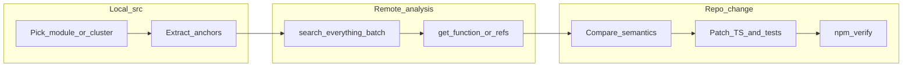

# Src-first alignment with remote binary analysis (MCP)

## Constraints (non-negotiable)

- **Comments / codebase wording**: Do not name reverse-engineering tooling or vendors in `src` comments or identifiers. Prefer neutral phrasing such as **“observed game behavior”**, **“original engine behavior”**, or **“runtime-verified invariant”** when documenting why TypeScript matches native semantics.
- **Validation**: After non-trivial TS changes, follow repo policy in `[AGENTS.md](c:/GitHub/KotOR.js/AGENTS.md)`: `npm run format:check`, `npm run lint`, `npm test`, plus `npm run webpack:dev` (or `webpack:prod` when bundling is affected).

## Reality check on scope

There are on the order of **~1470** `.ts`/`.tsx` files under `[src](c:/GitHub/KotOR.js/src)`. “Align the entirety” is **correct as an ongoing objective**, but execution must be **inventory-driven and phased**. This plan defines the loop; completion is measured **per subsystem** (see Done criteria).

## Remote tooling capabilities (read-first workflow)

Use the `**user-agdec-http`** MCP tools (schemas under `[mcps/user-agdec-http/tools](C:/Users/boden/.cursor/projects/c-GitHub-KotOR-js/mcps/user-agdec-http/tools)`):

| Step        | Tool                                                                | Role                                                                                                                                                    |
| ----------- | ------------------------------------------------------------------- | ------------------------------------------------------------------------------------------------------------------------------------------------------- |
| Discover    | `search-everything`                                                 | **Default first call**: batch many keywords via `queries` in one request; optionally scope with `program_path` / `program_name` for K1 vs TSL binaries. |
| Narrow      | `search-symbols`, `search-strings`, `search-code`, `get-references` | Reduce candidates once you have anchor symbols/strings.                                                                                                 |
| Deep dive   | `get-function`                                                      | Single-function bundle (decompiled view + refs + call graph context). Prefer raising `timeout` only when needed.                                        |
| Context     | `get-current-program`, `list-project-files`                         | Confirm which binary is active and available paths (e.g. `/K1/k1_win_gog_swkotor.exe`, `/TSL/k2_win_gog_aspyr_swkotor2.exe`).                           |
| Fallback    | CLI (`agentdecompile-cli` against your server URL)                  | When MCP calls fail or the analysis backend is unhealthy; mirror `list-project-files` / targeted lookups.                                               |
| Last resort | `execute-script`                                                    | Bulk or API gaps only; keep scripts short and outcome-assigned to `__result__` per tool schema.                                                         |

**Write policy**: Prefer **read-only** alignment (`search-`*, `get-function`). Use `checkout-program` / `checkin-program` **only** if you intentionally mutate server-side analysis artifacts (usually unnecessary for KotOR.js TS fixes).

**Reliability**: Treat remote analysis as **best-effort**: when deep inspection fails, retry with smaller scope, different anchor queries, or CLI — without blocking unrelated subsystems.

## Src-first alignment loop (repeat per chunk)

1. **Pick a bounded chunk** (one file, one directory, or one feature slice — never “all of engine” at once).
2. **Extract anchors from TypeScript** (examples):
  - Magic signatures / FourCCs / struct sizes / enum numeric values
  - Known format strings or debug tokens still present in binaries
  - NWScript action/opcodes names from `[src/nwscript](c:/GitHub/KotOR.js/src/nwscript)`
  - Odyssey-adjacent identifiers already mirrored in TS (class names often won’t match mangled native symbols — combine **string literals + numeric constants + behavioral tests**)
3. **Batch-query** with `search-everything` (`queries: [...]`) — **one call**, many terms — optionally comparing `**/K1/...`** vs `**/TSL/...**` when gameplay differs.
4. **Confirm** the best candidate via `get-function` (and `get-references` when call chains matter).
5. **Decide**: match / intentional divergence / bug. If bug: patch TS, add/adjust unit tests near existing tests (`[*.test.ts](c:/GitHub/KotOR.js/src)`) so future drift fails loudly.
6. **Verify** with npm commands above.

## Phasing `./src` (recommended priority)

Work **high native coupling first**, **pure tooling/UI later**:

1. **Resource formats + parsers** (`[src/resource](c:/GitHub/KotOR.js/src/resource)`, `[src/loaders](c:/GitHub/KotOR.js/src/loaders)`) — strongest anchor density (magic bytes, sizes, tables).
2. **NWScript stack/compiler/decompiler** (`[src/nwscript](c:/GitHub/KotOR.js/src/nwscript)`).
3. **Engine/runtime simulation** (`[src/engine](c:/GitHub/KotOR.js/src/engine)`, `[src/module](c:/GitHub/KotOR.js/src/module)`, `[src/game](c:/GitHub/KotOR.js/src/game)` if present, combat/actions managers).
4. **Graphics/audio pipeline** where constants map to native caps (`[src/interface](c:/GitHub/KotOR.js/src/interface)`, `[src/managers](c:/GitHub/KotOR.js/src/managers)`).
5. **Forge / launcher / debugger UI** (`[src/apps](c:/GitHub/KotOR.js/src/apps)`) — align only where strings/symbols exist or behavior must mirror engine contracts; otherwise mark **out-of-scope for binary correlation** but still keep tests green.

Within each phase, maintain a simple **inventory checklist** (subsystem folders) and burn down files methodically.

## Done criteria (per subsystem)

A subsystem is “aligned” when:

- Representative anchors were searched with batched discovery + at least one confirmed native anchor for non-trivial logic.
- Discrepancies found are either **fixed in TS** or **explicitly documented as intentional** using neutral language (still no tooling/vendor naming in comments).
- Tests cover invariants that were corrected (prefer extending existing test files).
- Required npm verification passes for touched areas.

## What “full `./src` completion” means operationally

It is the **union** of all subsystem checklists reaching their done criteria. Expect **many iterations/PRs**; avoid mega-diffs.

## Notes on dual-game correctness

When behavior differs between KotOR I and II:

- Prefer verifying **both** program paths when anchors exist in both.
- Keep TS structure that already splits K1/K2 (`[NWScriptDefK1.ts](c:/GitHub/KotOR.js/src/nwscript/NWScriptDefK1.ts)` vs `[NWScriptDefK2.ts](c:/GitHub/KotOR.js/src/nwscript/NWScriptDefK2.ts)`) and extend **game-specific tables** rather than blending silently.

