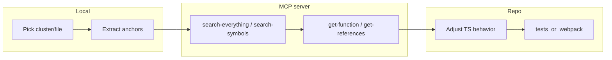

# Local-first MCP alignment for `./src` (runtime focus)

## Scope (confirmed)

- **In scope:** Engine/runtime, modules, combat, actions, effects, loaders, resource format semantics, and game-facing code under [`src/engine/`](src/engine/), [`src/module/`](src/module/), [`src/combat/`](src/combat/), [`src/actions/`](src/actions/), [`src/effects/`](src/effects/), [`src/loaders/`](src/loaders/), [`src/resource/`](src/resource/), [`src/game/`](src/game/), plus shared utilities that directly affect on-disk or wire formats (e.g. [`src/utility/GameFileSystem.ts`](src/utility/GameFileSystem.ts), binary helpers).
- **Out of scope unless tied to formats/engine contracts:** Forge/Launcher/Debugger presentation layers.

## Reality check

- **Volume:** ~1,225 `.ts` + ~245 `.tsx` files; “entirety” means a **long-running program** of small PR-sized slices with a **coverage checklist**, not a single sweep.
- **Server constraints:** Pseudocode may be unavailable when the remote analysis service fails to launch its decompiler; **`get-function` still yields signatures, disassembly, callees/callers, and imports**—use those as primary evidence when pseudocode is blank.
- **Title split:** Use **`/K1/k1_win_gog_swkotor.exe`** for KotOR I and **`/TSL/k2_win_gog_aspyr_swkotor2.exe`** for KotOR II. Symbol density differs (K1 tends to recover more names); fall back to **string/import anchors** (e.g. `glReadPixels`, distinct TLS filenames) and **call-graph tracing** on K2.

## Workflow (repeat per slice)

1. **Pick a cluster** from the phased backlog below (one cohesive area per PR/session).
2. **Extract local anchors:** distinctive **method names**, **error strings**, **magic constants**, **resource extensions**, **GFF field names**, **NWScript-related literals**, and **OpenGL/DirectInput/API imports** visible in the TS implementation.
3. **Query MCP (always pass `program_path`):**
   - Batch terms with **`search-everything`** (`queries` array, scopes like `functions`, `strings`, `imports`, `comments` where useful).
   - **`get-function`** on the best hit for **call graph + disassembly**; **`get-references`** (`mode=import` / `to`) to follow hot paths.
4. **Record discrepancy:** ordering differences (e.g. save screenshot **before** stall vs after export), missing steps, wrong dimensions, wrong enum values—themes only matter if observable in retail modules or on-disk layout.
5. **Fix TypeScript** to match **observed retail behavior**; in comments/docstrings use neutral wording (**never** name external analysis tools or vendors). Prefer tightening behavior + adding/adjusting tests under [`src/**/*.test.ts`](src/resource/) or targeted engine tests where they exist.
6. **Validate:** `npm run format:check`, `npm run lint`, `npm test`, and `npm run webpack:dev` per [`AGENTS.md`](AGENTS.md) for touched runtime paths.

## Phased backlog (runtime_focus)

| Phase | Directories / themes | MCP anchor examples |
| ----- | ------------------- | --------------------- |
| P0 | Save/load pipeline | Save folder layout, screenshot size, stall ordering — already touched in [`src/engine/SaveGame.ts`](src/engine/SaveGame.ts), [`src/GameState.ts`](src/GameState.ts), [`src/resource/TGAObject.ts`](src/resource/TGAObject.ts) |
| P1 | Resource serializers/parsers | Magic headers, field layouts — [`src/resource/*.ts`](src/resource/) |
| P2 | Engine loop / timing / rendering hooks | `MainLoop`, frame/update ordering — [`src/engine/OdysseyEngine.ts`](src/engine/OdysseyEngine.ts), [`src/GameState.ts`](src/GameState.ts) |
| P3 | Module objects / AI / actions | Class-shaped symbols when present; else script/message strings — [`src/module/`](src/module/), [`src/actions/`](src/actions/) |
| P4 | Combat / effects | Talent/effect/Damage-related strings and dispatch chains — [`src/combat/`](src/combat/), [`src/effects/`](src/effects/) |
| P5 | Loaders / caches | Resource resolution paths matching KEY/BIF/ERF behavior — [`src/loaders/`](src/loaders/) |
| P6 | NWScript VM vs tooling | Bytecode/decompiler under [`src/nwscript/`](src/nwscript/) — align **only** where behavior must match the retail interpreter; many strings live in [`NWScriptDefK1/K2`](src/nwscript/NWScriptDefK1.ts) as documentation, not binary-proof |

## Coverage tracking

- Maintain a **single checklist file** (optional location: [`docs/solutions/`](docs/solutions/) or a lightweight `ALIGNMENT_COVERAGE.md` at repo root—only if you want it versioned; otherwise use GitHub Issues milestones).
- Each row: **cluster**, **files**, **binary path(s)**, **MCP query used**, **discrepancy**, **fix PR**, **tests run**.

## Already-identified example (P0)

Retail KotOR I save path shows a **256×256** (`0x100`) screenshot thumbnail, **OpenGL readback + vertical flip + TGA write** in the native helper chain called from server save logic; KotOR.js uses **canvas capture → 256×256 resize → `TGAObject.FromCanvas` (BGR + FlipY)** in [`GameState`](src/GameState.ts). Alignment work here is to **verify ordering** vs stall/export (documented as intentional divergence today in [`SaveGame.Save`](src/engine/SaveGame.ts)) and tighten any **pixel-format / dimension** mismatches—not to rename anything after tooling.

## Exit criteria for “done” with this program

- Checklist rows completed for **all in-scope directories**, or explicitly marked **N/A** (e.g. pure Editor UI).
- No new comments violating the **neutral wording** rule for parity notes.
